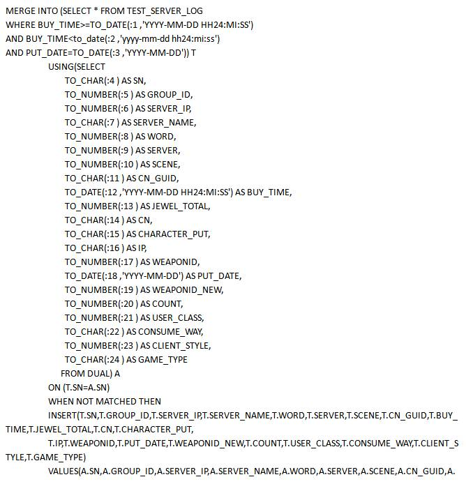
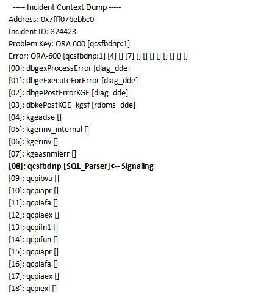
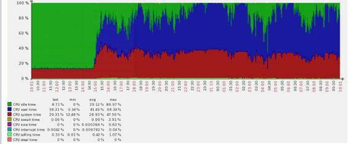

**作者介绍**

**杨建荣**，【DBAplus社群】联合发起人。现就职于搜狐畅游，Oracle ACE-A、YEP成员，超7年数据库开发和运维经验，擅长电信数据业务、数据库迁移和性能调优。持Oracle 10G OCP，OCM，MySQL OCP认证，《Oracle DBA工作笔记》作者。

Merge是从Oracle 9i就引入的功能，它是有别于其他DML中的一种特殊语句，类似于MySQL中的 insert into on duplicate key操作，而且Merge功能更丰富，可以同时对一个表中的数据进行insert和update操作，原本需要存储过程实现的工作现在用一条SQL语句就可以做到。确实很有亮点，从我的感觉来看，它带来的问题实在是不少，当然有不少是特定版本的特定问题。

比如最近有一个同事问我一个问题，他运行一个SQL语句抛出了ORA-00600的错误，想让我帮忙分析一下，我了解了问题的大体情况之后，发现值得好好琢磨一番，因为只是客户端调用抛出异常，没有给服务器端带来什么致命的影响，而且这个语句只是通过客户端工具测试所用，还没有正式部署，这样就给我分析问题带来了不少的时间和空间。

## 1.**问题描述**
---------

简单沟通后，我得到了同事提供的SQL语句和执行环境（数据库版本是11.2.0.3），语句类似下面的形式：

这样一个语句看起来结构挺复杂，但是细看逻辑倒不复杂。最近处理了不少性能问题，很多都是和Merge的使用有关，这次是不是又中招了呢，带着疑问来看这个语句，初步的感觉是绑定变量真是多。

这个问题带给我的最大福利就是能够复现，这一点真是非常难得，有很多的ORA-00600错误复现需要上下文环境触发一定的条件才可以复现，可遇不可求，就像前些天社群的一篇文章《腾讯高级工程师：一道面试题引发的高并发性能调试思考》，需要动用大量的技巧来复现分析，可能是一个平均运行一百万次才出现一次的bug。而这个问题让我省了不少事，在alert日志中也发现了对应的trace文件，但是从里面得到的信息着实有限。

## 2.**复现问题**
---------

我没有花太多时间在这个trace上，转而尝试去复现这个问题，首先我通过v$sql去数据库中查看这个SQL语句，结果查找的很仔细，竟然没有任何的信息，仿佛这个语句没有执行过一般，所以这个语句在解析时就出了问题。

然后我切换到属主用户下，尝试生成执行计划。庆幸的是这个时候问题可以复现出来了。

由此可见，这个语句在SQL解析的时候就会抛出问题。对于这个报错，在MetaLink上进行一番查找，发现相关的bug还真不少，锁定了一个较为符合的bug.

这是和执行Merge相关的，出现的版本是11.2.0.3，查看里面的解释，就是打补丁，没有其它的解决方法。

其实对于ORA-00600的错误，就类似开发中的NULLPointerException，这类问题的边界比较模糊，排查需要花费一些精力，有的时候还需要一些运气。

## 3.**初步结论**
---------

我的初步感觉就是问题可能在两个方面。

1.  一个是TEST\_SERVER\_LOG这个表数据量非常大，是否在Merge中有一定的影响导致
2.  语句中含有大量的绑定变量，是否绑定变量数过多导致了Merge的支持出现了问题

于是我朝着这个方向进行了分析和排查。**我****逐个替换了绑定变量，把它暂时替换为常量**，发现错误依旧出现，只是错误的参数部分会有下标的变化。

直到我把整个using部分的**绑定变量全部替换掉**，竟然抛出了一个看起来不大相关的错误。

看这个问题，是字段不存在，仔细查看源表中的字段信息，发现确实如此，我是如获至宝，好像定位到了问题的原因。

但是经过确认，原来这个表的属主是另外一个，切换了开发同学使用的用户之后，语句就可以正常解析了，问题的原因是什么呢？

我们可以通过下面这个语句来说明，在没有绑定变量的情况下解析会正常通过。

所以这个时候就比较纠结，很多应用场景都是需要使用绑定变量的，所以尽管如此，这不是一个通用的解决方法。然后我尝试在using子句中添加一个绑定变量，ORA-00600问题再次出现，可见二十多个绑定变量和一个绑定变量都会出现同样的问题。

所以一个初步结论是，**这个错误和绑定变量还是有一定的关系，但是具体原因还无法定位**。  
那么这个问题是否和数据量有关呢。经过确认，这个相关表TEST\_SERVER\_LOG的数据量情况如下，只有一行数据。

所以可以证明，**这个****bug****和****TEST\_SERVER\_LOG****的数据量无关****，****绑定变量的部分还得进一步确认，目前暂时无法定位**。

我们再来看看trace文件中的内容：

SQL运行时抛出的错误为

那么qcsfbdnp代表什么含义呢，可以在trace文件中找到一些答案。

报错编码是\[qcsfbdnp:1\], \[7\], \[\], \[2\], \[\], \[\],  这个代表的含义在这个日志中可以看到是在SQL解析器的部分调用出现了问题。

所以经过上面的排除之后，我们需要重新审视这个语句，看看是否存在一些隐患。

## 4.**模拟复现问题**
-----------

经过反复测试之后，我发现这个问题可以很容易复现。

当然我换一个方式来说明，我可以创建一个表，然后模拟这个ORA-00600的错误。

创建测试表test\_bug

然后使用如下的语句尝试生成执行计划。

可能眼尖的朋友发现这个里面有些语法问题，这也是我无意中埋下了几个探针，如果你看到语句哪里有问题，后续分析就会明白了。

这个语句里的问题我是可以保持了(select \* from test\_bug where object\_type=’TABLE’) t 这个子查询，抛出了ORA-00600的错误，我简化一番如何，简化为（select\*from test\_bug）t这个子查询，同样还是会抛出一样的错误。

我们来回过头来翻翻旧账，刚刚的语句的问题在如下红框的几个地方，在解析的时候都没有抛出错误，可见问题是出在这些之前，那么推理只有test\_bug相关的子查询了。

修复这几个语法问题之后，使用下面的方式就没有问题了，最后调用成功的语句如下，我们把子查询替换为表test\_bug

我们来反思一下，其实我们所写的merge语句都是merge into table\_xx using(xxxx) on (xxx)的形式。

在table\_xx的地方加入子查询，可能会让我们在联想到一些语句中使用子查询的DML方式，但是在merge语句中，这个地方会有问题，所幸的是这个问题目前的测试没有发现对线上环境产生严重的影响，需要引以为戒，不过问题还不能这么轻易下结论，我们继续往下看。

## 5.**认知的反转**
----------

如果只是像上面那么想，充其量只是一个攻略，而且你对Merge印象会更加糟糕。

难道是Merge有什么特别之处吗，我们来看看Oracle的官方对于Merge语句的解释。可以看到merge into后面可以是table或者是view.

我在上面的测试使用的是子查询，那么试试view可不可行呢。

我们创建一个view.

create view test\_view as select \* from test\_bug where object\_type=’TABLE’;

我滴个神，这个问题确实就是这么任性，那么我们是不是可以得出一个结论，在merge into的后面只能使用table或者view，不能使用子查询呢，还是不要过早下结论。

## 6.**持续反转（二）**
------------

对于这个问题，我们也进行了小范围的讨论，兔子大师在看到我的这个问题之后，在11.2.0.4的版本中进行了测试，之前我碰到的那个问题在这个版本中就不复存在了，兔子威武。

测试复现的过程很简单：

create table test\_bug as select \* from dba\_objects where rownum<1;

解析生成执行计划，可以看到这个时候就没有问题了。

可见这个问题在11.2.0.4之前的版本会抛出ORA-00600，算是一个bug中的bug吧。

## 7.**简单总结**
---------

通过上面波澜起伏的测试和复现、验证，我们可以得出这样的一个结论：这个问题和表中的数据量无关，和是否使用子查询也没有关系，是在特定版本中出现的一个特定的问题，当然明白了原委，我们完全可以规避这个问题。

而且这个场景中Merge的使用有些不太到位，其实也可以考虑使用INSERT语句来实现。

## 8.**反思**
-------

对于Merge语句的更多反思，如下：

1.  我所从事的一些调优工作中，对于Merge的优化很难下手，因为这虽然是一个语句，但是有多重执行路径，执行计划没法确定，使用调优工具大多也给不出建议。
2.  在10g的版本中，如果scheduler中使用PL/SQL块，包含有Merge语句，使用dbms\_metadata.get\_ddl竟然无法查看到完整的DDL信息。
3.  如果你想查看到DDL的信息，如果通过解析dmp的方式，就会发现DMP对于这个语句的处理很是特殊，可能又会让你失望了。

这些问题会或多或少困扰到你，而我印象很深的案例，则是第1项中列举的，优化类的困扰。我举一个例子。

下面是我在一次系统监控中发现的一个性能问题，CPU使用异常，而经过分析发现瓶颈来源于数据库层面的一个SQL语句。

看到的语句类似这样的形式：

查看执行计划发现里面存在大量的全表扫描，资源消耗极高。

而这个语句的逻辑其实仔细看看还能明白，就是在插入一条记录前看看表中是否含有，如果没有就插入，否则更新，但是里面使用了count(\*)的方式处理，过滤条件存在一些潜在的问题，而优化方式就是简化这种逻辑。改为如下的方式：

## 9.**总结**
-------

很多的事情都有两面性，Merge语句就是如此，而且是一种特殊的存在，可能很多问题在特定版本中出现，在升级之后问题就会迎刃而解，而如果分析不当，可能我牢牢攥在手里的就是一个错误的结论，所以很多观点碰撞还是会摩擦出不少的火花，大家共同从中受益。我依然记得很久之前的一次技术争论中，有人说道：判断一个技术的优劣，也需要看待，到底是它带来的问题更多还是解决的问题更多？

确实如此。

文章出处：DBAplus社群

本文链接：https://dbaplus.cn/news-10-662-1.html