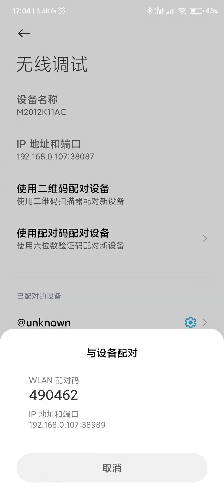

最后更新时间: 2021年3月28日 22:45:37

Android 11 支持通过 Android 调试桥 (adb) 从工作站以无线方式部署和调试应用。例如，您可以将可调试的应用部署到多台远程设备，而无需通过 USB 实际连接您的设备，从而避免常见的 USB 连接问题（例如驱动程序安装方面的问题）。

如需使用无线调试，您需要使用配对码将您的设备与工作站配对。您的工作站和设备必须连接到同一无线网络。如需连接到您的设备，请按以下步骤操作：

1. 在您的工作站上，更新到最新版本的 [SDK 平台工具](https://developer.android.com/studio/releases/platform-tools)。

2. 在设备上启用[开发者选项](https://developer.android.com/studio/debug/dev-options)。

3. 启用**无线调试**选项。

4. 在询问**要在此网络上允许无线调试吗？**的对话框中，点击**允许**。

5. 选择**使用配对码配对设备**。记下设备上显示的配对码、IP 地址和端口号（参见图片）。
   

6. 在工作站上，打开一个终端并导航到 `android_sdk/platform-tools`。

7. 运行 `adb pair ipaddr:port`。使用第 5 步中的 IP 地址和端口号。

8. 当系统提示时，输入您在第 5 步中获得的配对码。系统会显示一条消息，表明您的设备已成功配对。

   ```shell
   Enter pairing code: 490462
   Successfully paired to 192.168.0.107:38989 [guid=adb-235XY]
   ```
   
9. （仅适用于 Linux 或 Microsoft Windows）运行 `adb connect ipaddr:port`。使用**无线调试**下的 IP 地址和端口。
